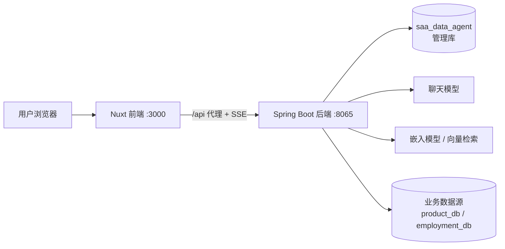

# 01. 项目架构与模块职责

## 1. 它解决什么问题

DataAgent 将自然语言问题转成对“已授权业务数据库”的查询和分析报告。它不是直接把整张表发给模型，而是先召回业务知识和表结构，再让模型规划、生成 SQL、校验、执行并生成报告。

## 2. 代码模块

| 模块 | 技术 | 主要职责 |
| --- | --- | --- |
| 根项目 | Maven 聚合工程 | 统一 Java 17、Spring Boot 3.4.8、Spring AI 等依赖版本。 |
| `data-agent-management` | Java / Spring Boot / MyBatis | 后端 API、智能体与数据源管理、工作流、SQL 执行、知识向量化。 |
| `data-agent-frontend-nuxt` | Nuxt 4 / Vue 3 / Vuetify / Pinia | 管理控制台、聊天页、SSE 流式展示。 |
| `docs` | Markdown | 项目原有说明与本学习指南。 |

后端启动类是 `data-agent-management/src/main/java/com/alibaba/cloud/ai/dataagent/DataAgentApplication.java`。

## 3. 运行时关系

前端的 `nuxt.config.ts` 将 `/api/**` 代理到 `http://localhost:8065/api/**`，所以在浏览器中访问前端时，页面 API 请求仍使用 `/api/...` 相对路径。

## 4. 两类数据库必须分开理解

### 管理库：`saa_data_agent`

由后端 `spring.datasource` 配置连接，用于项目本身。它会保存智能体、模型配置、数据源配置、选表关系、知识、会话等。默认配置位置：

`data-agent-management/src/main/resources/application.yml`

### 业务库：例如 `product_db`、`employment_db`

在“数据源管理”页面创建，并绑定给某个智能体。工作流中的 `SqlExecuteNode` 会根据 `agentId` 动态获取这个业务数据源配置，再执行生成的 SQL。

这也是为什么一个智能体可以分析订单库，另一个智能体可以分析就业库；二者不用、也不应该直接查询管理库。

## 5. 后端包结构速览

| 目录 | 作用 |
| --- | --- |
| `controller` | HTTP API，例如智能体、数据源、模型、知识和图工作流接口。 |
| `service` | 业务编排，例如 `graph`、`schema`、`datasource`、`llm`。 |
| `workflow/node` | 每个 AI 工作流节点的实现。 |
| `workflow/dispatcher` | 决定节点之后走向、重试或结束。 |
| `connector` | 不同数据库的连接和查询访问器。 |
| `mapper` / `entity` | MyBatis 数据持久化。 |
| `prompt` 与 `resources/prompts` | 模型提示词组装和模板文件。 |
| `config` | Spring Bean、工作流图、向量库和检查点配置。 |

## 6. 前端页面对应关系

| 用户功能 | 页面文件 |
| --- | --- |
| 创建/编辑智能体 | `app/pages/agent/new.vue`、`app/pages/agent/[id].vue` |
| 聊天与工作流时间线 | `app/pages/chat.vue`、`app/components/chat/` |
| 模型配置 | `app/pages/system/model-config.vue` |
| 数据源与选表 | `app/pages/system/data-sources/index.vue` |
| 智能体知识库 | `app/pages/knowledge/agents.vue` |
| 业务知识配置 | `app/pages/knowledge/business.vue` |

## 7. 学习时的边界

系统会尽力校验 SQL，但“模型生成 SQL”不等于数据库权限控制。接入真实数据时应使用只读账号、只选择允许分析的表，并避免保存个人敏感信息。
