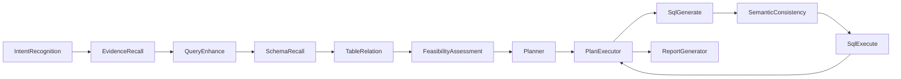

# 03. 从提问到报告的调用链

以问题“各专业的就业率排名如何？”为例，本章把页面日志对应到实际代码。

## 1. 前端发起 SSE 请求

聊天页通过 `app/services/graph/index.ts` 创建 `EventSource`，请求：

```text
GET /api/stream/search?agentId=<智能体ID>&conversationId=<会话ID>&query=<问题>...
```

Nuxt 将它代理到后端 8065。后端入口是：

`data-agent-management/src/main/java/com/alibaba/cloud/ai/dataagent/controller/GraphController.java`

接口返回 Server-Sent Events（SSE），所以页面可以一边显示“正在生成 SQL”，一边等待最终报告，而不是一直空白。

## 2. GraphService 创建一次工作流运行

`GraphController` 将请求交给：

`service/graph/GraphServiceImpl.java`

它会：

1. 生成本次运行的 `threadId`；
2. 读取或创建 `conversationId` 对应的多轮上下文；
3. 把 `agentId`、用户问题、上下文写入图状态；
4. 调用已编译的 `StateGraph`，并持续将节点输出转换为 SSE。

`agentId` 很关键：它决定当前可用的数据源、数据表以及智能体专属知识。

## 3. 工作流节点顺序

图定义位于：

`config/DataAgentConfiguration.java`

普通数据分析请求的主要路径如下：



如果计划需要 Python 分析，`PlanExecutor` 还会转到 Python 生成、执行和分析节点；如开启人工审核，会在 `HumanFeedbackNode` 前暂停。

## 4. 页面日志与代码的对应

| 页面日志 | 主要类 | 它做什么 |
| --- | --- | --- |
| 意图识别 | `IntentRecognitionNode` | 判断请求是否属于可处理的数据分析问题。 |
| 查询重写、获取证据 | `EvidenceRecallNode` | 将问题改为适合检索的独立问题，从业务知识和智能体知识中召回证据。 |
| 问题增强 | `QueryEnhanceNode` | 将业务口语整理为更明确、可检索的标准问题。 |
| 初步召回 Schema | `SchemaRecallNode` | 从已初始化的表/字段向量文档中查找相关 Schema。 |
| 选择数据表、处理关系 | `TableRelationNode` | 筛选表、字段并梳理关联关系。 |
| 可行性评估 | `FeasibilityAssessmentNode` | 判断当前 Schema 与证据是否足够回答问题。 |
| 执行计划 | `PlannerNode`、`PlanExecutorNode` | 决定接下来生成 SQL、运行 Python 或生成报告。 |
| 生成 SQL | `SqlGenerateNode` | 基于计划、Schema、证据和问题构造 SQL。 |
| 语义一致性校验 | `SemanticConsistencyNode` | 检查生成 SQL 是否符合过滤、聚合和关联要求。 |
| 执行 SQL | `SqlExecuteNode` | 通过当前智能体的数据源连接执行 SQL，并保存结果。 |
| 报告已生成 | `ReportGeneratorNode` | 将查询结果组织成可阅读的报告。 |

## 5. 为什么“初始化数据源”不可跳过

初始化请求是：

```text
POST /api/agent/{agentId}/datasources/init
```

后端入口在 `controller/AgentDatasourceController.java`。它读取当前智能体的激活数据源和已选表，把 Schema 转成文档写入向量存储。

`SchemaRecallNode` 只会从这些 Schema 文档中召回表。如果页面日志显示“初步表信息召回数量：0”，通常不是 SQL 模型坏了，而是：

- 当前 `agentId` 没有激活数据源；
- 没有勾选表；
- 尚未初始化；
- 初始化后换了嵌入模型。

## 6. 数据真正在哪里执行

`SqlExecuteNode` 从图状态读取 `agentId`，调用 `DatabaseUtil.getAgentDbConfig(agentId)` 和对应数据库访问器。SQL 因此执行在当前业务数据库，而不是 `saa_data_agent` 管理库。

阅读该节点时重点看两件事：SQL 是怎样被清理/校验后执行的，以及执行异常怎样写入“重新生成 SQL”的原因。

## 7. 一个排障思路

按日志从前往后定位：

1. 意图识别结束：问题是否被当成数据分析？
2. 证据为空：不一定错误，只表示没有命中知识库。
3. Schema 数量为 0：先检查数据源绑定、选表和初始化。
4. SQL 生成失败：查看对应提示词和 Schema 是否完整。
5. SQL 执行失败：复制页面展示的 SQL，在业务库中单独执行验证。
6. SQL 有结果但报告异常：检查报告生成节点和模型响应。
