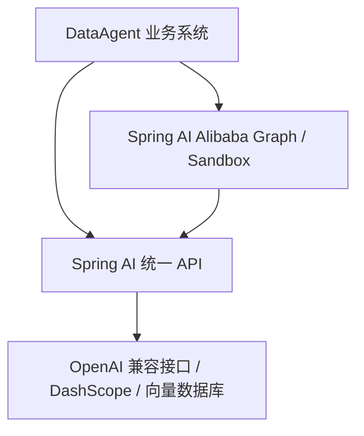

# 01. 先建立正确认知

## 1. 一句话理解 Spring AI

Spring AI 是一套面向 Java/Spring 应用的 AI 集成抽象。它把不同厂商的聊天模型、嵌入模型、向量数据库、工具调用等能力，包装成相对统一的 Java API 和 Spring Boot 配置方式。

它与 Spring Data 的思路相似：业务代码尽量面向统一接口，具体模型厂商由实现和配置决定。

## 2. 四层关系



| 层 | 在本项目中负责什么 |
| --- | --- |
| 大模型服务 | 真正执行文本生成或向量计算，例如兼容 OpenAI 协议的服务。 |
| Spring AI | 提供 `ChatModel`、`ChatClient`、`EmbeddingModel`、`VectorStore`、Tool、Memory 等抽象。 |
| Spring AI Alibaba | 在 Spring AI 之上提供 Graph、DashScope 集成、Sandbox 等能力。 |
| DataAgent | 将这些能力组合成自然语言查库、分析和报告系统。 |

因此，`IntentRecognitionNode` 是本项目代码，`NodeAction` 来自 Spring AI Alibaba Graph，`ChatResponse` 来自 Spring AI，真正生成文本的是外部模型。

## 3. 最需要掌握的对象

| 对象 | 初学者理解 | 本项目位置 |
| --- | --- | --- |
| `ChatModel` | 对某个聊天模型的底层 Java 适配器 | `DynamicModelFactory#createChatModel` |
| `ChatClient` | 更易用的模型调用客户端，负责拼装消息、Advisor、流式/非流式调用 | `AiModelRegistry#getChatClient` |
| `Prompt` / Message | 发给模型的输入；常见角色是 system、user、assistant | 项目通过 `ChatClient.prompt().system().user()` 构造 |
| `ChatResponse` | 模型的一次响应及其元数据 | `LlmService` 的返回类型 |
| `EmbeddingModel` | 把文本转换为数值向量 | `DynamicModelFactory#createEmbeddingModel` |
| `Document` | 需要索引/检索的文本及 metadata | `DocumentConverterUtil` |
| `VectorStore` | 保存向量并做相似度检索 | `AgentVectorStoreServiceImpl` |
| `ChatMemory` | 按会话保存消息历史 | `MultiTurnContextManager` |
| `ToolCallback` | 可被模型描述和调用的 Java 工具 | `McpServerConfig`、`McpServerService` |
| `StateGraph` | 定义多步骤工作流的图 | `DataAgentConfiguration#nl2sqlGraph` |
| `OverAllState` | 节点之间共享的运行状态 | 每个 `workflow/node` 的 `apply` 参数 |

## 4. 模型并不是数据库

大模型本身通常不知道你的实时数据，也不能直接访问数据库。一次可靠的数据问答需要应用程序完成：

1. 理解用户问题。
2. 找到相关业务知识和表结构。
3. 让模型生成一个候选 SQL。
4. 由应用程序检查和执行 SQL。
5. 把真实执行结果再交给模型生成报告。

在本项目里，数据库访问发生在 Java 代码中，而不是模型“进入”数据库。模型只产生计划、SQL 或文本；连接、权限和执行仍由应用控制。

## 5. Agent 到底是什么

在工程里，可以把 Agent 理解成：

```text
Agent = 模型 + 指令 + 上下文/记忆 + 知识检索 + 工具 + 控制流 + 安全边界
```

简单聊天只需要一次 `ChatClient` 调用。DataAgent 要经历意图识别、知识召回、Schema 召回、规划、SQL 校验、执行和报告，因此使用 Graph 显式编排。这比让模型自由决定一切更容易调试、审计和重试。

## 6. 本项目的两个“动态”特点

### 动态模型

模型配置保存在管理库，通过页面激活。`AiModelRegistry` 懒加载并缓存当前聊天模型和嵌入模型；配置变化后清理缓存，下次调用重新创建。

所以不要只在 `application.yml` 里找模型名和 API Key。

### 动态业务数据源

每个智能体可绑定自己的业务数据源。Graph 状态中的 `agentId` 决定使用哪个数据源、哪些表和哪些知识。

管理库 `saa_data_agent` 保存配置；业务库才是分析对象。两者不可混为一谈。

## 7. 判断一段代码属于哪一层

看 import 最快：

- `org.springframework.ai...`：Spring AI 核心抽象。
- `com.alibaba.cloud.ai.graph...`：Spring AI Alibaba Graph。
- `com.alibaba.cloud.ai.dataagent...`：本项目业务代码。
- `reactor.core.publisher...`：Reactor 响应式流，不是 AI 专属 API。

## 本章自测

1. `ChatClient` 和真正的模型服务是什么关系？
2. 模型生成 SQL 后，SQL 是谁执行的？
3. 为什么本项目需要 Graph，而一个普通聊天 Demo 不一定需要？
4. `agentId` 会影响哪三类资源？

如果能用自己的话回答，你已经具备继续读源码的正确地图。
