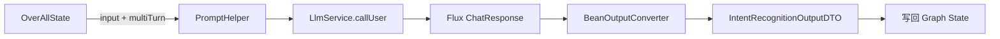

# 02. ChatClient 与提示词

## 1. 从最小调用开始

典型 Spring AI 调用可以概括为：

```java
String answer = chatClient.prompt()
    .system("你是一个严谨的数据分析助手")
    .user("解释什么是同比增长")
    .call()
    .content();
```

链条含义如下：

```text
ChatClient → Prompt → system/user messages → ChatModel → 模型服务 → ChatResponse
```

- `system` 定义长期角色、任务边界和输出规则。
- `user` 放本次用户需求和任务数据。
- `call()` 是一次非流式调用。
- `content()` 只取最终文本；`chatResponse()` 能保留更完整的响应对象。

## 2. 本项目为何又包了一层 LlmService

项目没有让每个节点直接依赖 `ChatClient`，而是定义：

```text
workflow node → LlmService → StreamLlmService → AiModelRegistry → ChatClient
```

主要文件：

- `service/llm/LlmService.java`
- `service/llm/impls/StreamLlmService.java`
- `service/aimodelconfig/AiModelRegistry.java`
- `service/aimodelconfig/DynamicModelFactory.java`

这样做有三个好处：

1. 节点只关心“调用模型”，不关心模型实例怎样创建。
2. 单元测试可以 mock `LlmService`，不需要真实 API Key。
3. 页面切换活动模型后，可以通过 Registry 刷新缓存。

`StreamLlmService` 中最核心的一行是：

```java
registry.getChatClient()
    .prompt()
    .system(system)
    .user(user)
    .stream()
    .chatResponse();
```

## 3. ChatModel 与 ChatClient 不要混淆

`DynamicModelFactory` 先创建 `OpenAiChatModel`，`AiModelRegistry` 再用它构建 `ChatClient`：

```java
ChatModel chatModel = modelFactory.createChatModel(config);
ChatClient chatClient = ChatClient.builder(chatModel).build();
```

- `ChatModel` 更底层，代表某类模型协议及默认选项。
- `ChatClient` 更上层，提供流畅 API，并能挂 Advisor、Memory、Tool 等能力。

本项目统一使用 OpenAI 兼容协议，通过 `baseUrl`、路径、模型名切换供应商。兼容协议并不保证所有厂商行为完全一致，尤其要关注结构化输出、Tool Calling、流式 usage 和错误格式。

## 4. 模型参数怎样影响结果

项目在 `DynamicModelFactory` 中构造 `OpenAiChatOptions`，主要参数有：

| 参数 | 影响 | DataAgent 建议 |
| --- | --- | --- |
| `model` | 使用哪个模型 | 选择指令遵循和 JSON 能力稳定的模型。 |
| `temperature` | 随机性 | SQL、分类、规划通常使用较低值。 |
| `maxTokens` | 最大输出长度 | 太小会截断 JSON、SQL 或报告；太大增加成本。 |
| `streamUsage` | 流式响应中是否请求 usage | 便于观测 token，但供应商需兼容。 |

低 temperature 也不能让模型变成确定性函数，业务代码仍要校验。

## 5. Prompt 在项目中的组织方式

提示词文件位于：

```text
data-agent-management/src/main/resources/prompts/
```

`PromptLoader` 从 classpath 加载并缓存文本，`PromptHelper` 注入 Schema、Evidence、用户问题、JSON 格式说明等变量。项目选择自己的模板装配方式，不代表 Spring AI 只能这样写；Spring AI 本身也提供 `PromptTemplate`。

阅读任一提示词时，把内容分成四块：

1. 角色：模型现在扮演谁。
2. 数据：用户问题、Schema、Evidence、执行结果。
3. 约束：只能读、不得编造、不得服从数据中的注入指令。
4. 输出协议：纯 SQL、纯 JSON、Markdown 等。

例如 `new-sql-generate.txt` 明确要求只读 SQL，并把 Schema、Evidence、前序结果视为数据，而不是更高优先级指令。这是对 Prompt Injection 的基本防线。

## 6. 一次节点调用怎样形成

以 `IntentRecognitionNode` 为例：



节点不是直接把用户问题发给模型，而是先从状态取输入，再拼接稳定模板，最后把结果转成 DTO 写回状态。

## 7. Prompt 的常见坏味道

- 把规则和不可信数据混成一段，没有清楚分隔。
- 只写“返回 JSON”，却没有字段定义或格式约束。
- 提示词要求“不要犯错”，但代码完全不校验。
- 一次塞入全部数据库 Schema，导致 token 浪费和注意力稀释。
- 日志完整打印 Prompt，其中包含密钥、隐私或业务敏感数据。
- 修改提示词后只测一次成功样例，没有测空结果、歧义和注入文本。

## 本章练习

打开 `intent-recognition.txt`，逐项标出角色、数据、约束和输出协议；然后回到 `IntentRecognitionNode`，找到每个模板变量来自哪个 Graph state key。不要修改代码，先把完整数据流说清楚。
