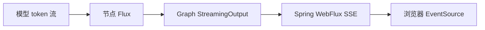

# 03. 结构化输出与流式响应

## 1. 为什么自然语言不能直接驱动程序分支

程序希望得到：

```json
{
  "classification": "《可能的数据分析请求》",
  "response": ""
}
```

模型却可能返回解释、Markdown 代码块、缺字段 JSON，甚至语法错误。若直接用字符串包含判断来路由，系统会很脆弱。

因此本项目把“给人看的输出”和“给程序用的输出”分开：

- 报告可以是 Markdown。
- 意图、计划、可行性、SQL 语义校验等控制信息必须转为 Java DTO。

## 2. BeanOutputConverter 做什么

典型写法：

```java
BeanOutputConverter<IntentRecognitionOutputDTO> converter =
    new BeanOutputConverter<>(IntentRecognitionOutputDTO.class);

IntentRecognitionOutputDTO result = converter.convert(modelText);
```

它承担两个相关任务：

1. 根据 Java 类型提供结构化格式说明或 JSON Schema 信息。
2. 把模型文本反序列化为目标 Java 类型。

DTO 字段设计应尽量简单、明确、有限。枚举式字符串要限制允许值，并在业务层再次验证。

## 3. 本项目的“双保险”

`StreamLlmService` 对需要结构化结果的调用挂载 `StructuredOutputValidationAdvisor`：

```java
StructuredOutputValidationAdvisor advisor =
    StructuredOutputValidationAdvisor.builder()
        .outputType(outputType)
        .maxRepeatAttempts(2)
        .build();
```

然后节点仍使用 `BeanOutputConverter` 转换最终文本。

可以这样理解：

```text
Advisor：发现格式不合格时，要求模型修复（最多重试）
Converter：把最终文本变成 Java 对象
业务校验：检查对象在当前业务中是否合理
```

三者不能互相替代。合法 JSON 仍可能语义错误，例如模型返回不存在的表名。

## 4. 为什么结构化调用看起来“不流式”

普通文本调用使用：

```java
.stream().chatResponse()
```

结构化校验调用使用：

```java
.call().chatResponse()
```

因为完整 JSON 到齐后更适合统一验证和修复。项目再通过 `Mono.fromCallable(...).subscribeOn(Schedulers.boundedElastic()).flux()` 把阻塞调用包进响应式链，避免直接阻塞 Reactor 事件线程。

所以“方法返回 `Flux`”不等于底层模型一定逐 token 流式输出。阅读响应式代码时，要继续看内部究竟调用了 `.stream()` 还是 `.call()`。

## 5. Flux 的最小心智模型

`Flux<T>` 表示 0 到多个异步到达的元素：

```text
onNext(chunk1) → onNext(chunk2) → ... → onComplete
                                  ↘ onError
```

本项目常见操作：

| 操作 | 含义 |
| --- | --- |
| `map` | 把每个元素转换成另一种类型。 |
| `concatWith` / `Flux.concat` | 严格按顺序拼接多个流。 |
| `doOnNext` | 在不改变元素的情况下收集或记录副作用。 |
| `subscribe` | 真正启动流并处理元素、错误和完成。 |
| `Sinks.Many` | 由应用主动向多个/单个订阅者推送事件。 |

## 6. 模型流与浏览器 SSE 不是一回事

本项目有两层流：



- 模型流：模型供应商逐块返回内容。
- Graph 流：节点把“开始处理”、模型片段、完成消息包装为 `StreamingOutput`。
- SSE：`GraphController` 通过 `text/event-stream` 把事件持续推给前端。

即使某个节点内部是一次阻塞 `.call()`，Graph 仍可以在节点前后发送进度事件，但该节点中间不会逐 token 更新。

## 7. 错误必须沿流传播

正确的响应式链应明确处理：

- 模型调用失败；
- JSON 转换失败；
- 客户端断开；
- Graph 节点异常；
- 流正常完成。

`GraphServiceImpl` 在 `subscribe` 中分别注册 next、error、complete 处理，并在错误或结束时清理 `StreamContext`、checkpoint 和追踪数据。只处理成功数据而忽略 `onError`，很容易造成前端永久等待和资源泄漏。

## 8. 测试结构化节点的方法

`IntentRecognitionNodeTest` 展示了一个很实用的模式：

1. mock `LlmService` 返回固定 `ChatResponse`。
2. 构造最小 `OverAllState`。
3. 执行节点并收集流。
4. 同时断言 DTO、最终 state 和展示文本。
5. 再测试非法 JSON、模型异常、多轮上下文和长输入。

这类测试不需要真实模型，运行快且稳定。真实模型测试应另放集成测试，避免普通单元测试受网络、费用和模型漂移影响。

## 本章自测

1. 为什么合法 JSON 仍需业务校验？
2. 为什么返回 `Flux` 不代表真正的 token 流？
3. 模型流和 SSE 分别解决什么问题？
4. `StructuredOutputValidationAdvisor` 与 `BeanOutputConverter` 的职责有什么不同？
