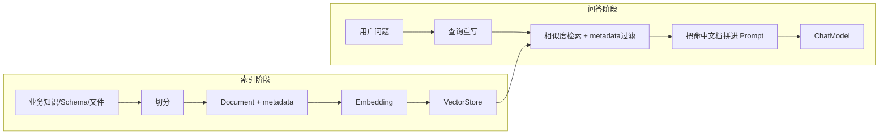

# 04. Embedding、向量库与 RAG

## 1. 为什么需要 Embedding

传统关键词搜索要求字面相似，而 Embedding 将文本映射为一组数字，使语义相近的文本在向量空间中更接近。

例如“销售额最高的区域”和“哪个大区营收第一”字面不同，但语义可能接近。`EmbeddingModel` 负责生成向量，`VectorStore` 负责保存并按相似度检索。

```text
文本 → EmbeddingModel → [0.12, -0.03, ...] → VectorStore
查询 → EmbeddingModel → 查询向量 → 相似度搜索 → 相关 Document
```

## 2. Spring AI 的三个核心对象

### Document

`Document` 通常包含：

- `id`：唯一标识。
- `text`：参与向量化和召回的正文。
- `metadata`：数据源、表名、文档类型、agentId 等过滤信息。

本项目的 `DocumentConverterUtil` 会把表、列、业务知识和智能体知识转换为不同类型的 `Document`。

### EmbeddingModel

本项目由 `DynamicModelFactory#createEmbeddingModel` 创建 `OpenAiEmbeddingModel`。`DataAgentConfiguration` 又提供动态代理 Bean，每次调用都从 `AiModelRegistry` 取得当前活动嵌入模型。

### VectorStore

统一提供 `add`、`delete`、`similaritySearch` 等能力。本项目默认用扩展后的 `MetadataAwareSimpleVectorStore`，也引入了 Milvus 和 Elasticsearch 等 Starter。

## 3. RAG 的完整链路

RAG（Retrieval-Augmented Generation）不是模型训练，而是在调用模型前检索外部资料并塞入上下文：



索引阶段失败，问答阶段就召回不到；召回成功但 Prompt 未拼接文档，模型仍然无法利用知识。

## 4. 本项目没有简单套用 QuestionAnswerAdvisor

Spring AI 提供 `QuestionAnswerAdvisor` 和模块化 RAG 组件，但本项目选择显式实现检索链路：

```text
EvidenceRecallNode
  → AgentVectorStoreService
  → VectorStore.similaritySearch
  → 格式化业务知识/智能体知识
  → 写入 EVIDENCE state
  → 后续 Prompt 使用
```

Schema 召回则是另一条独立链：

```text
SchemaRecallNode
  → 找到 agent 的活动 datasourceId
  → 按规范化问题召回表 Document
  → 按表名取得列 Document
  → 写入 TABLE/COLUMN_DOCUMENTS state
```

显式实现的好处是可以分别展示日志、设置不同阈值、按 `agentId` / `datasourceId` 做隔离，并在 Graph 中针对空结果路由。

## 5. 数据源“初始化”到底做了什么

这里的初始化不是把业务数据复制进管理库，而是：

1. 读取当前数据源中已选择的表和字段元数据。
2. 将表、列、关系等信息转换成 `Document`。
3. 调用 Embedding 模型生成向量。
4. 写入 VectorStore，供 `SchemaRecallNode` 检索。

因此下列操作之后通常要重新初始化：

- 第一次绑定数据源或重新选择表；
- 表结构有重要变化；
- 更换了嵌入模型；
- 更换向量库或清空索引。

更换 Embedding 模型后旧向量和新查询向量可能不在同一空间，维度也可能不同，不能假定仍可混用。

## 6. metadata 过滤为何重要

只按相似度搜索可能把别的智能体、别的数据源、别的文档类型召回。本项目在 `DynamicFilterService` 和 `AgentVectorStoreServiceImpl` 中构造过滤表达式。

主要隔离方式：

- 表/列 Schema 使用 `datasourceId`。
- 业务知识和智能体知识使用 `agentId`。
- `vectorType` 区分 TABLE、COLUMN、BUSINESS_TERM、AGENT_KNOWLEDGE 等类型。

这不仅影响准确率，也是多租户数据边界的一部分。应用层过滤不能替代向量数据库自身的访问控制和网络隔离。

## 7. topK 与 similarityThreshold

`SearchRequest` 常见参数：

```java
SearchRequest.builder()
    .query(query)
    .topK(topK)
    .similarityThreshold(threshold)
    .filterExpression(filter)
    .build();
```

| 参数变化 | 可能结果 |
| --- | --- |
| `topK` 太小 | 漏掉需要关联的表或知识。 |
| `topK` 太大 | 噪声增多，Prompt 变长，模型选错表。 |
| 阈值太高 | 召回为空。 |
| 阈值太低 | 不相关文档进入上下文。 |

本项目在 `application.yml` 中分别配置表召回和默认召回参数。调参时必须用一组代表性问题评估，不要只凭一次结果。

## 8. 切分策略的影响

长文档在入库前需要切分。块太大时信息混杂且成本高；块太小时上下文破碎。项目包含 token、段落、句子和语义切分相关实现。

切分后应保留来源 metadata，最终报告或调试日志才能知道证据来自哪个文件或知识条目。

## 9. 召回质量排查顺序

1. 是否存在活动 Embedding 模型，且测试调用成功？
2. 数据源/知识是否真的完成向量化？
3. `agentId`、`datasourceId`、`vectorType` 是否正确？
4. 查询重写结果是否保留了关键业务词？
5. topK 与 threshold 是否过严？
6. 命中文档的 text 和 metadata 是否正确？
7. 命中文档是否真正拼入后续 Prompt？

## 本章练习

选择一个已初始化的数据源，给 `SchemaRecallNode` 准备三个问题：一个明显相关、一个同义表达、一个完全无关。记录每次召回的表名和数量，再解释结果差异。先观察，不急着调参数。
