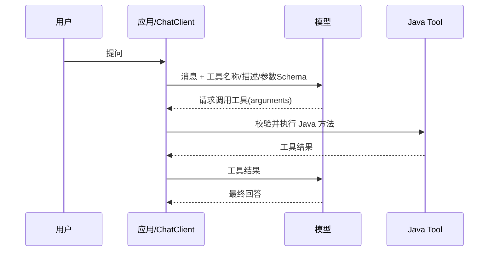

# 05. 记忆、工具调用与 MCP

## 1. 模型默认没有会话记忆

聊天模型 API 本质上是无状态的。第二次请求若不再次带上历史，模型不会自动知道第一次说了什么。

Spring AI 用 `ChatMemory` 表示会话消息存储，用 `ChatMemoryRepository` 负责底层持久化。常见思路是按 `conversationId` 读取最近若干消息，再加入新 Prompt。

## 2. 本项目怎样实现多轮上下文

`DataAgentConfiguration` 创建 `MessageWindowChatMemory`，最大消息数大约是配置轮数的两倍。`MultiTurnContextManager` 负责：

1. 新问题开始时记录 pending turn。
2. Graph 执行过程中收集 `PlannerNode` 输出。
3. 成功结束后保存“用户问题 + AI 计划”。
4. 下一轮把历史格式化成文本，写入 `MULTI_TURN_CONTEXT`。
5. 各节点通过 `PromptHelper` 把这段上下文显式放进 Prompt。

这里有一个重要区别：项目没有给 `ChatClient` 全局挂 `MessageChatMemoryAdvisor`；它用 Spring AI 的 `ChatMemory` 存储能力，再自行选择“只保存问题和计划、怎样拼进节点提示词”。

这种方式更可控，也避免把整个长报告和所有中间事件都塞回模型。

## 3. 三种 ID 不要混淆

| ID | 作用 |
| --- | --- |
| `agentId` | 决定智能体配置、知识和业务数据源。 |
| `conversationId` | 用户层面的多轮对话标识，用来读写 ChatMemory。 |
| `threadId` | 一次 Graph 运行及 checkpoint/流上下文的标识。 |

同一 `conversationId` 可以先后产生多个运行 `threadId`。人工反馈恢复时要沿用对应的 Graph `threadId`，否则找不到检查点。

## 4. Tool Calling 是什么

Tool Calling 的核心流程：

模型只“建议调用哪个工具和传什么参数”。真正执行工具的是应用。模型不会直接获得数据库或 Java 方法权限。

Spring AI 1.1 可用 `@Tool` 声明方法，并通过 `ToolCallback` / `ToolCallbackProvider` 暴露给模型。

## 5. Tool 与 Graph 节点不是同一概念

本项目中：

- `McpServerService` 的方法使用 `@Tool`，属于 Spring AI Tool Calling。
- `SqlGenerateNode`、`SqlExecuteNode` 等实现 `NodeAction`，属于 Graph 工作流节点。
- `PlannerNode` 输出 `toolToUse`，`PlanExecutorDispatcher` 根据状态选择下一个节点；这是应用显式路由，不是 ChatClient 自动工具循环。

两种方案都能“选择动作”，但控制权不同：

| 方式 | 谁控制流程 | 适合场景 |
| --- | --- | --- |
| Tool Calling | 模型提出工具调用，框架执行并回传 | 工具集合较清晰、允许模型动态选择。 |
| Graph | Java 定义节点、边和条件 | 多步骤、需重试/审核/恢复/强控制的流程。 |

DataAgent 的核心 NL2SQL 使用 Graph，是因为它需要可观测的阶段、确定的校验顺序和失败重试。

## 6. MCP 是什么

MCP（Model Context Protocol）是一种让 AI 客户端发现和调用外部工具/资源的协议。可以把它理解成 AI 工具生态中的标准连接方式，而不是一个具体模型。

本项目依赖 `spring-ai-starter-mcp-server-webflux`，并在 `McpServerConfig` 中把 `McpServerService` 包装成 `MethodToolCallbackProvider`。这样 MCP 客户端可发现诸如“查询智能体列表”“自然语言转 SQL”的工具。

这里项目是 MCP Server：它向外暴露能力。一个应用如果连接别人的 MCP Server，则扮演 MCP Client。

## 7. Tool 的安全边界

工具描述不是权限系统。至少要做到：

- 工具参数在 Java 端校验，不能相信模型生成的 arguments。
- 数据库工具使用只读账号并限制表范围。
- 有副作用的工具按用户/租户鉴权，并考虑人工确认。
- 设置超时、并发、结果大小和重试上限。
- Tool 输出也属于不可信数据，重新放回 Prompt 时防注入。
- 不把高风险工具设成所有请求都可用的默认工具。

## 8. 什么时候用 Memory、RAG、Tool

| 需求 | 选择 |
| --- | --- |
| 记住刚才用户说过的话 | Chat Memory |
| 从大量静态/半静态资料中找相关内容 | RAG / VectorStore |
| 查询实时天气、数据库或调用业务 API | Tool Calling |
| 多步骤、有条件分支、重试或人工审核 | Graph |

它们可以组合，但不要用一个概念代替另一个。例如，把全部产品手册存进聊天历史，不如用 RAG；把数据库查询结果“记忆”下来，也不能保证实时性。

## 本章自测

1. 为什么本项目保存“问题 + 计划”，而不是把全部 SSE 内容作为记忆？
2. 模型请求调用工具时，谁真正执行 Java 方法？
3. MCP Server 和 MCP Client 有什么区别？
4. `SqlExecuteNode` 为什么是 Graph 节点而不是一次自由 Tool Calling？
