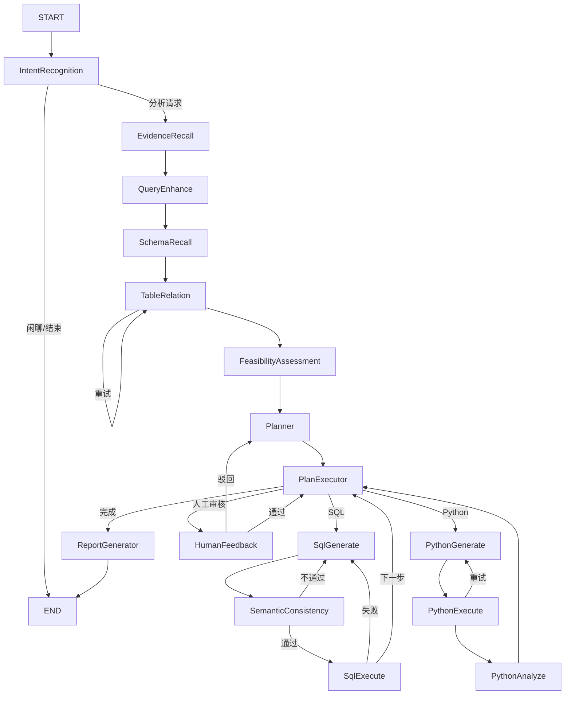

# 06. Spring AI Alibaba Graph

## 1. 为什么需要 Graph

一次模型调用适合简单问答，但数据分析需要多步决策：有些请求应直接结束，有些需要召回 Schema，有些 SQL 失败后要重试，有些计划必须人工审核。

Graph 把流程显式表示为节点和边：

```text
节点 Node：做一件事
边 Edge：下一步去哪里
状态 State：节点之间传什么数据
检查点 Checkpoint：流程暂停/恢复所需的快照
```

## 2. 五个核心类型

| 类型 | 作用 | 本项目对应 |
| --- | --- | --- |
| `StateGraph` | 声明节点、边、条件路由 | `DataAgentConfiguration#nl2sqlGraph` |
| `NodeAction` | 一个节点的执行逻辑 | `IntentRecognitionNode` 等 |
| `EdgeAction` | 根据 state 决定下一节点 | `workflow/dispatcher` 下各类 |
| `OverAllState` | 本次运行的共享状态 | 每个节点 `apply(state)` |
| `CompiledGraph` | 编译后的可执行图 | `GraphServiceImpl` 注入并调用 `stream` |

## 3. 定义一个最小图

概念示例：

```java
StateGraph graph = new StateGraph("demo", keyStrategyFactory)
    .addNode("classify", classifyNode)
    .addNode("answer", answerNode)
    .addEdge(START, "classify")
    .addConditionalEdges("classify", route,
        Map.of("answer", "answer", END, END))
    .addEdge("answer", END);
```

构图阶段只是定义流程；编译后才得到可运行的 `CompiledGraph`。

## 4. State 是 Graph 的主干

节点通过 state 读取输入，再返回 `Map<String, Object>` 更新状态：

```java
public Map<String, Object> apply(OverAllState state) {
    String query = StateUtil.getStringValue(state, INPUT_KEY);
    return Map.of("normalized_query", normalize(query));
}
```

本项目在 `KeyStrategyFactory` 中为每个 key 配置 `KeyStrategy.REPLACE`，表示新值替换旧值。更复杂图可能对列表使用追加等合并策略。

状态 key 是节点之间的契约。修改 key 名、类型或清理时机，都可能影响多个下游节点。读源码时应先追 state key，再追局部实现。

## 5. 条件边与 Dispatcher

普通边总是去固定节点；条件边先执行 Dispatcher，再根据返回的节点名查路由表。

本项目示例：

- `IntentRecognitionDispatcher`：数据分析请求继续，闲聊/无关请求结束。
- `SchemaRecallDispatcher`：有相关 Schema 才继续。
- `SemanticConsistenceDispatcher`：SQL 合格则执行，否则回到生成节点。
- `SQLExecutorDispatcher`：执行成功回到计划执行器，失败回到 SQL 生成。
- `PlanExecutorDispatcher`：选择 SQL、Python、报告、人工反馈或重新规划。

这就是项目“会循环”的原因。源码并不是从上到下只执行一次。

## 6. 本项目主图



实际边定义以 `DataAgentConfiguration` 为准。

## 7. 检查点和人工审核

`CompileConfig` 注册 checkpoint saver，并设置：

```java
.interruptBefore(HUMAN_FEEDBACK_NODE)
```

默认 `MysqlSaver` 将状态持久化；也可配置 `MemorySaver`。当流程在人工反馈前中断时，后续请求使用相同 `threadId`：

1. 从 checkpoint 找回状态。
2. `updateState` 写入反馈。
3. `compiledGraph.stream(null, resumeConfig)` 恢复执行。

因此“暂停”不是终止，“恢复”也不是创建一个全新的图运行。

## 8. Graph streaming

节点可以返回包含 `Flux<GraphResponse<StreamingOutput>>` 的结果。`GraphServiceImpl` 订阅 `CompiledGraph.stream(...)`，识别 `StreamingOutput`，再转换成前端需要的 SSE 数据。

流式输出有两类价值：

- 用户体验：展示“正在召回 Schema”“正在生成 SQL”等阶段。
- 可观测性：知道失败发生在哪个节点、第几次尝试。

展示消息不应被下游当作业务 state。项目用 state key 保存程序数据，用 streaming chunk 保存展示数据。

## 9. 阅读一个节点的固定模板

打开任何 `workflow/node/*Node.java`，按下面顺序读：

1. `implements`：它是哪种 Graph action。
2. 构造器字段：依赖哪些服务。
3. `apply` 开头：从 state 读取哪些 key。
4. 中间逻辑：调用模型、向量库、数据库还是纯 Java。
5. 返回 Map：写入哪些 key。
6. 对应 Dispatcher：成功、失败和重试分别去哪。
7. 对应测试：期望的状态与边界条件。

## 10. Graph 常见故障

- 节点返回了错误 key，下游读取不到。
- state 中对象类型与读取类型不一致。
- Dispatcher 返回的名称不在条件边 Map 中。
- 重试计数没有增加或成功后没有清零，形成死循环。
- 异常被吞掉，Graph 误以为节点成功。
- checkpoint 的 `threadId` 不一致，人工反馈无法恢复。
- 把大对象长期留在 state，造成序列化、内存和数据库压力。

## 本章练习

从 `SQLExecutorDispatcher` 开始，分别追踪“SQL 成功”和“SQL 失败”两条路径。写下每条路径修改了哪些 state key、下一个节点是什么、重试何时停止。
