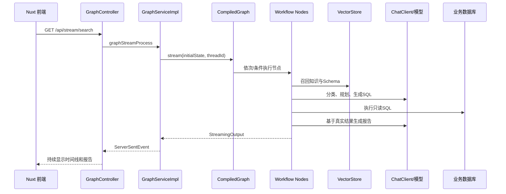

# 07. 本项目完整调用链

本章以用户提问“统计各地区销售额，并给出排名”为例，不深入每个算法，只追踪一次真实请求怎样穿过系统。

## 1. 总览



## 2. HTTP 入口

前端发起：

```text
GET /api/stream/search
  ?agentId=...
  &conversationId=...
  &query=...
  &humanFeedback=false
  &nl2sqlOnly=false
```

后端入口是 `controller/GraphController.java`。它：

1. 声明响应类型 `text/event-stream`。
2. 创建 `Sinks.Many<ServerSentEvent<GraphNodeResponse>>`。
3. 将请求参数封装为 `GraphRequest`。
4. 调用 `graphService.graphStreamProcess(...)`。
5. 返回 `sink.asFlux()`，客户端断开时停止对应运行。

Controller 并不执行 AI 逻辑，它负责协议适配和连接生命周期。

## 3. 创建运行上下文

核心类是 `service/graph/GraphServiceImpl.java`。首次提问时，它会生成或确认：

- `conversationId`：多轮会话。
- `threadId`：本次 Graph 运行。
- `StreamContext`：SSE sink、当前文本类型、已收集输出等。

随后构造初始状态：

```java
Map.of(
    IS_ONLY_NL2SQL, nl2sqlOnly,
    INPUT_KEY, query,
    AGENT_ID, agentId,
    HUMAN_REVIEW_ENABLED, humanReviewEnabled,
    MULTI_TURN_CONTEXT, multiTurnContext,
    TRACE_THREAD_ID, threadId
)
```

再调用：

```java
compiledGraph.stream(initialState,
    RunnableConfig.builder().threadId(threadId).build());
```

## 4. 第一阶段：判断与补全问题

### IntentRecognitionNode

输入：原始问题、多轮上下文。

动作：使用 `intent-recognition.txt` 调模型，结构化为 `IntentRecognitionOutputDTO`。

输出：意图分类；闲聊时还会写入 `FINAL_ANSWER`。

路由：数据分析继续，否则结束。

### EvidenceRecallNode

输入：原始问题、`agentId`、多轮上下文。

动作：先将追问改写为独立问题，再按 metadata 分别召回业务术语和智能体知识。

输出：格式化后的 `EVIDENCE`。

### QueryEnhanceNode

输入：用户问题、多轮上下文、Evidence。

动作：整理为明确的规范化查询和扩展查询。

输出：`QueryEnhanceOutputDTO`。后续节点应优先使用 canonical query，而不是不断改写原始问题。

## 5. 第二阶段：找到正确的数据库结构

### SchemaRecallNode

输入：规范化查询、`agentId`。

动作：

1. 用 `agentId` 找活动 `datasourceId`。
2. 从向量库召回相关表 `Document`。
3. 根据命中表名取得列 `Document`。

输出：表文档和列文档列表。

### TableRelationNode

输入：候选表/列、Evidence、问题。

动作：选择真正需要的表，补充字段和关联关系，形成 `SchemaDTO`。

输出：`TABLE_RELATION_OUTPUT`、数据库方言等。

### FeasibilityAssessmentNode

输入：规范化问题、Evidence、整理后的 Schema。

动作：判断现有信息能否回答；不足时应给出最小澄清，而不是编造。

输出：结构化可行性结果；Dispatcher 决定继续或结束。

## 6. 第三阶段：规划

### PlannerNode

模型基于问题和 Schema 输出 `Plan` JSON。计划包含多个 `ExecutionStep`，每一步说明：

- 步骤编号；
- 使用 SQL、Python 还是报告；
- 当前步骤指令；
- 最终总结要求。

### PlanExecutorNode

它不是执行所有业务的“大节点”，而是计划状态机：校验计划、读取当前步骤、写入 `PLAN_NEXT_NODE`，再由 `PlanExecutorDispatcher` 路由。

如果计划非法，可以回 `PlannerNode` 修复；若启用人工审核，可以在实际执行前暂停。

## 7. 第四阶段：SQL 生成、校验与执行

### SqlGenerateNode

输入不只是用户问题，还包括：

- 当前 `ExecutionStep` 的 instruction；
- `SchemaDTO`；
- Evidence；
- 数据库 dialect；
- 前序步骤结果；
- 上次失败 SQL 和异常原因（重试时）。

模型输出 SQL 后，节点清理代码块等包装并写入 state。达到最大重试次数会停止。

### SemanticConsistencyNode

判断 SQL 是否真正完成当前步骤，例如过滤、聚合、关联和字段是否匹配。语义不通过时，将原因写回并路由到 `SqlGenerateNode`。

### SqlExecuteNode

这是 SQL 真正执行的位置。它按 `agentId` 取得业务数据源配置，通过数据库访问器执行 SQL，并保存结果。执行失败时把错误原因写回，Dispatcher 再让生成节点修复。

因此重试闭环是：

```text
生成 SQL → 语义检查 → 执行
    ↑          |不通过     |数据库报错
    └──────────┴───────────┘
```

模型校验不能代替数据库错误，数据库执行成功也不能证明业务语义一定正确，所以两层都需要。

## 8. 可选 Python 分析

计划需要二次统计时，路径为：

```text
PythonGenerateNode → PythonExecuteNode → PythonAnalyzeNode → PlanExecutorNode
```

- 生成节点只生成受约束的分析脚本。
- 执行节点交给 Sandbox，受 CPU、内存、超时和并发配置限制。
- 失败可按上限重新生成。
- 分析节点把真实 Python 输出转成简洁说明。

不要把 LLM 生成代码直接在后端主进程中无限制执行。

## 9. 最终报告

`ReportGeneratorNode` 读取：

- 用户原始需求；
- 完整计划；
- 各步骤真实 SQL/Python 执行结果；
- 总结和建议要求；
- 智能体级 Prompt 优化配置。

然后使用 `report-generator-plain.txt` 调模型，生成 Markdown 报告并写入 `RESULT`。报告中的数字应来自真实执行结果，而不是 Planner 的推测。

## 10. 输出回到浏览器

每个节点的 `StreamingOutput` 被 `GraphServiceImpl#handleStreamNodeOutput` 转成 `GraphNodeResponse`，包含：

- `threadId`；
- 节点名；
- 步骤 ID 和 attempt；
- 文本片段；
- 文本类型（普通文本、JSON、SQL、Markdown 等）。

`GraphController` 将其作为 SSE 返回。流程正常完成、异常或等待人工反馈时，还会发送相应协议事件。

## 11. 读代码时始终问五个问题

对每个节点都写下：

1. 从 state 读什么？
2. 调用了模型、向量库、数据库还是纯 Java？
3. 向 state 写什么？
4. 向用户展示什么？
5. Dispatcher 在成功、失败时分别去哪？

能回答这五个问题，就真正看懂了这个节点，而不是只看懂了几行 Java。
